<div align="center">

# 📊 Infrared & XANES Scale Detector
### Sim2Real: Automated Axis Extraction via YOLOv11-Pose

[](https://www.python.org/)
[](https://github.com/ultralytics/ultralytics)
[](https://pytorch.org/)
[](LICENSE)

<p align="center">
  <strong>A Sim2Real solution for digitizing scientific charts.</strong><br>
  Optimized for XANES & Infrared Spectra with Dual Y-Axis support.
</p>

[Overview](#overview) • [Key Features](#key-features) • [Model Weights](#model-weights) • [Workflow](#workflow) • [Usage](#usage)

</div>

---

<a id="overview"></a>
## 📖 Project Overview

This project automates the extraction of **axes, tick marks, and tick labels** from scientific literature. It is specifically optimized for a **broad range of chemical spectra**—including but not limited to **XANES** and **Infrared (IR)**—robustly handling common challenges like low resolution, complex layouts (Dual Y-Axes), and noise.

To solve the data scarcity problem, we use a **Sim2Real** pipeline: generating synthetic charts, applying "degradation" (blur/noise/JPEG artifacting), and training a **YOLOv11-Pose** model to detect tick marks as Keypoints and text as Bounding Boxes.

<a id="key-features"></a>
### ✨ Key Features
- **Dual Y-Axis Support**: Explicitly trained to handle charts with secondary Y-axes (Right Axis).
- **Sim2Real Degradation**: Uses `albumentations` to simulate scanning artifacts (Blur, Compression, Noise).
- **Smart Oversampling**: Automatically oversamples real-world training data (3x factor) to balance the synthetic/real ratio.
- **Two-Stage Training**:
    - **Stage 1**: High-res (1024px) pre-training on synthetic data.
    - **Stage 2**: Fine-tuning on mixed data with aggressive box loss (`box=8.5`) for high recall.

---

<a id="model-weights"></a>
## 🏆 Model Weights

| File Name | Description |
| :--- | :--- |
| **`best.pt`** | **Recommended for Inference.** The final weight file resulting from **Stage 2 (Fine-tuning)**. It achieves the best balance of precision and recall on real-world scientific charts. |

> **Note**: Ensure `best.pt` is placed in the `weights/` directory (or root) before running inference scripts.

---

<a id="workflow"></a>
## 🚀 Workflow

```mermaid
%%{init: {'theme': 'base', 'themeVariables': { 'primaryColor': '#e3f2fd', 'edgeLabelBackground':'#ffffff', 'tertiaryColor': '#fff'}}}%%
flowchart LR
    %% Style Definitions
    classDef data fill:#e1f5fe,stroke:#0277bd,stroke-width:2px,rx:5,ry:5;
    classDef proc fill:#f3e5f5,stroke:#7b1fa2,stroke-width:2px,rx:5,ry:5,stroke-dasharray: 5 5;
    classDef model fill:#fff3e0,stroke:#ef6c00,stroke-width:3px,rx:10,ry:10;

    subgraph SG1 ["1. Data Engineering"]
        direction TB
        A["🎨 Gen: Dual-Axis Charts"]:::proc --> B("Synthetic Images"):::data
        B --> C{"🌫️ Degrade\n(Blur/JPEG/Noise)"}:::proc
        C --> D("Degraded Synth"):::data
        R["🧠 Real LabelMe JSON"]:::data -.-> S{"🛠️ json2yolo"}:::proc
        S --> E("Real YOLO Labels"):::data
    end
    
    subgraph SG2 ["2. Dataset Assembly"]
        D & E --> M{"🔀 Split & Mix\n(Real Data x3 Oversampling)"}:::proc
        M --> F[("📦 Mixed Dataset")]:::data
    end
    
    subgraph SG3 ["3. Training Strategy"]
        F --> G{{"🚀 Stage 1: Pre-train"}}:::model
        G ==> H{{"🏆 Stage 2: Fine-tune\n(Outputs: best.pt)"}}:::model
    end
    
    style SG1 fill:#f9f9f9,stroke:#cfd8dc
    style SG2 fill:#f5f5f7,stroke:#b0bec5
    style SG3 fill:#fff8e1,stroke:#ffcc80

```



---

<a id="file-structure"></a>

## 📂 File Structure

### 1. Data Generation

| File | Description |
| --- | --- |
| `synthetic chart generator.py` | **Core Engine**. Generates Line/Scatter charts with **Dual Y-Axes** and auto-labels. |
| `augment_data.py` | **Sim2Real Adapter**. Applies Gaussian/Motion Blur and JPEG Compression. |
| `json2yolo_mixed.py` | **Converter**. Transforms LabelMe JSONs to YOLO Pose format. |

### 2. Training & Inference

| File | Description |
| --- | --- |
| `1_split_data.py` | **Assembler**. Splits data (8:1:1) and performs **3x Oversampling** on real samples. |
| `2_train.py` | **Stage 1 (Pre-train)**. Synthetic data only, `imgsz=1024`. |
| `resume_train.py` | **Stage 2 (Fine-tune)**. Transfer learning on mixed data. **Produces `best.pt`.** |
| `3_inference.py` | **Inference**. Runs detection using `best.pt` and visualizes results. |

---

<a id="usage"></a>

## 🛠️ Getting Started

### 1. Environment Setup

```bash
pip install torch==2.6.0+cu124 torchvision --index-url [https://download.pytorch.org/whl/cu124](https://download.pytorch.org/whl/cu124)
pip install ultralytics albumentations matplotlib opencv-python tqdm

```

### 2. Training (Optional)

If you want to re-train the model from scratch:

```bash
# 1. Generate & Augment Data
python "synthetic chart generator.py"
python augment_data.py

# 2. Prepare Dataset
python 1_split_data.py

# 3. Train (Stage 1 & 2)
python 2_train.py
python resume_train.py

```

### 3. Inference (Using Pre-trained Weights)

To use the provided **`best.pt`** model on your own images:

```bash
# Run inference on a folder of images
# Ensure 'best.pt' is in the correct path (e.g., weights/best.pt)
python 3_inference.py --model weights/best.pt --source "path/to/your/images"

```

---

<div align="center">
<p>Developed for Scientific Data Extraction | 2025</p>
</div>
