<div align="center">

# 📊 Infrared & XANES Scale Detector
### Sim2Real: Automated Axis Extraction via YOLOv11-Pose

[](https://www.python.org/)
[](https://github.com/ultralytics/ultralytics)
[](https://pytorch.org/)
[](LICENSE)

<p align="center">
  <strong>A Sim2Real solution for digitizing scientific charts (XANES & Infrared Spectra).</strong><br>
  Features Dual Y-Axis support, advanced degradation augmentation, and two-stage transfer learning.
</p>

[Overview](#overview) • [Key Features](#key-features) • [Workflow](#workflow) • [File Structure](#file-structure) • [Usage](#usage)

</div>

---

<a id="overview"></a>
## 📖 Project Overview

This project automates the extraction of **axes, tick marks, and tick labels** from scientific literature. It is specifically optimized for a broad range of chemical spectra—including but not limited to XANES and Infrared (IR)—robustly handling common challenges like low resolution, complex layouts (Dual Y-Axes), and noise.

To solve the data scarcity problem, we use a **Sim2Real** pipeline: generating synthetic charts, applying "degradation" (blur/noise/JPEG artifacting), and training a **YOLOv11-Pose** model to detect tick marks as Keypoints and text as Bounding Boxes.

<a id="key-features"></a>
### ✨ Key Features (Updated)
- **Dual Y-Axis Support**: The synthetic generator and model are explicitly trained to handle charts with secondary Y-axes (Right Axis).
- **Sim2Real Degradation**: Uses `albumentations` to simulate scanning artifacts (Gaussian Blur, Motion Blur, JPEG Compression, Noise).
- **Smart Oversampling**: The data splitter automatically oversamples real-world training data (3x factor) to balance the synthetic/real ratio.
- **Two-Stage Training**:
    - **Stage 1 (Pre-train)**: High-resolution (1024px) training on massive synthetic data with AdamW.
    - **Stage 2 (Fine-tune)**: Transfer learning on mixed data with aggressive box loss weights (`box=8.5`) to improve recall.
- **Strict Inference Logic**: Includes a specialized inference script with confidence filtering, pairing checks, and L/R/T/B stack sorting.

---

<a id="workflow"></a>
## 🚀 Workflow

```mermaid
%%{init: {'theme': 'base', 'themeVariables': { 'primaryColor': '#e3f2fd', 'edgeLabelBackground':'#ffffff', 'tertiaryColor': '#fff'}}}%%
flowchart LR
    %% Style Definitions
    classDef data fill:#e1f5fe,stroke:#0277bd,stroke-width:2px,rx:5,ry:5;
    classDef proc fill:#f3e5f5,stroke:#7b1fa2,stroke-width:2px,rx:5,ry:5,stroke-dasharray: 5 5;
    classDef model fill:#fff3e0,stroke:#ef6c00,stroke-width:3px,rx:10,ry:10;

    subgraph SG1 ["1. Data Engineering"]
        direction TB
        A["🎨 Gen: Dual-Axis Charts"]:::proc --> B("Synthetic Images"):::data
        B --> C{"🌫️ Degrade\n(Blur/JPEG/Noise)"}:::proc
        C --> D("Degraded Synth"):::data
        R["🧠 Real LabelMe JSON"]:::data -.-> S{"🛠️ json2yolo"}:::proc
        S --> E("Real YOLO Labels"):::data
    end
    
    subgraph SG2 ["2. Dataset Assembly"]
        D & E --> M{"🔀 Split & Mix\n(Real Data x3 Oversampling)"}:::proc
        M --> F[("📦 Mixed Dataset\n(Train/Val/Test)")]:::data
    end
    
    subgraph SG3 ["3. Training Strategy"]
        F --> G{{"🚀 Stage 1: Pre-train\n(Sz=1024, AdamW)"}}:::model
        G ==> H{{"🏆 Stage 2: Fine-tune\n(Sz=960, High Loss Wt)"}}:::model
    end
    
    style SG1 fill:#f9f9f9,stroke:#cfd8dc
    style SG2 fill:#f5f5f7,stroke:#b0bec5
    style SG3 fill:#fff8e1,stroke:#ffcc80

```



---

<a id="file-structure"></a>

## 📂 File Structure

### 1. Data Generation & Processing

| File | Description |
| --- | --- |
| `synthetic chart generator.py` | **Core Engine**. Generates Line/Bar/Scatter/Pie charts using Matplotlib. Supports **Dual Y-Axes**, random clutter, and auto-labeling. |
| `augment_data.py` | **Sim2Real Adapter**. Applies specific degradations: Gaussian/Motion Blur, JPEG Compression (Q30-75), and Noise. |
| `json2yolo_mixed.py` | **Converter**. Converts LabelMe JSONs to YOLO Pose format. Uses Nearest Neighbor logic to pair Tick Marks (Points) with Labels (Rects). |

### 2. Dataset Management

| File | Description |
| --- | --- |
| `1_split_data.py` | **Assembler**. Splits Real data (8:1:1), performs **3x Oversampling** on real training samples, and mixes in degraded synthetic data. Generates `.yaml` config. |
| `synthetic chart verification.py` | **Debugger**. Visualizes generated YOLO labels on synthetic images to verify coordinate alignment. |
| `val annotated real...yolo.py` | **Validator**. Visualizes ground truth annotations on the real validation set (Supports Chinese paths). |

### 3. Training

| File | Description |
| --- | --- |
| `2_train.py` | **Stage 1 (Pre-train)**. Trains on synthetic data. Settings: `imgsz=1024`, `AdamW`, `cos_lr`, `close_mosaic=10`. |
| `resume_train.py` | **Stage 2 (Fine-tune)**. Loads best weights from Stage 1. Settings: `imgsz=960`, `box=8.5` (High Recall), `shear=2.0`, **Dual-Axis optimized**. |

### 4. Inference

| File | Description |
| --- | --- |
| `3_inference.py` | **Standard Inference**. Runs detection, filters by `conf=0.3`, extracts Top-2 pairs per axis, and visualizes results. |
| `real chart test.py` | **Strict Inference**. Applies stricter rules (`conf=0.5`, pairing validation). Sorts results into **L/R/T/B stacks** for complex layouts. |

---

<a id="usage"></a>

## 🛠️ Getting Started

### 1. Environment Setup

Install PyTorch (ensure compatibility with your CUDA version) and Ultralytics:

```bash
pip install torch==2.6.0+cu124 torchvision --index-url [https://download.pytorch.org/whl/cu124](https://download.pytorch.org/whl/cu124)
pip install ultralytics albumentations matplotlib opencv-python tqdm scipy

```

### 2. Data Preparation Pipeline

Follow this exact order to build the dataset:

```bash
# 1. Generate clean synthetic charts (e.g., 5000 images)
python "synthetic chart generator.py"

# 2. Apply Sim2Real degradation (Critical step)
python augment_data.py

# 3. (Optional) Convert your Real LabelMe data
python json2yolo_mixed.py

# 4. Mix datasets, apply oversampling, and generate YAML
python 1_split_data.py

```

### 3. Training Pipeline

The project uses a two-stage training strategy for maximum accuracy.

**Stage 1: Pre-training (Synthetic Focus)**

```bash
# Trains on 1024px resolution with AdamW
python 2_train.py

```

**Stage 2: Fine-tuning (Real & Dual-Axis Focus)**
*Update the checkpoint path in the script before running.*

```bash
# Resumes with higher box loss weights and geometric augmentations
python resume_train.py

```

### 4. Inference

Run the strict inference script to extract data from your test images:

```bash
# Configure paths inside the script first
python "real chart test.py"

```

---

## 📊 Performance & Strategies

| Strategy | Description | Benefit |
| --- | --- | --- |
| **ImgSz 1024** | Training at high resolution (1024px/960px). | Crucial for detecting tiny tick marks and separating dense text. |
| **Box Loss 8.5** | Increased loss weight for bounding boxes in Stage 2. | Reduces "missed detections" on the secondary Y-axis. |
| **Real Oversampling** | Real images are copied 3x in the training set. | Prevents the model from overfitting to the synthetic style. |
| **Close Mosaic** | Mosaic augmentation is turned off for the last 10 epochs. | Allows the model to stabilize on realistic, non-stitched images. |

---

<div align="center">
<p>Developed for Scientific Data Extraction | 2025</p>
</div>

```
### 主要更改说明 (Changes made based on your code):

1.  **Workflow 更新**：明确了 `1_split_data.py` 中的 **Oversampling (过采样)** 逻辑（3倍复制真实数据），这是解决数据不平衡的关键策略。
2.  **Training 区分**：明确区分了 `2_train.py` (Stage 1, 1024sz, 基础训练) 和 `resume_train.py` (Stage 2, 960sz, `box=8.5` 高召回率, 双Y轴适配)。
3.  **Feature 更新**：添加了 **Dual Y-Axis Support**（双Y轴支持），因为我在 `synthetic chart generator.py` 和 `resume_train.py` 中都看到了相关逻辑。
4.  **Sim2Real 细节**：在 `augment_data.py` 描述中具体化了使用的增强手段（JPEG压缩、高斯模糊等）。
5.  **Strict Inference**：加入了 `real chart test.py` 的描述，强调了它包含更严格的过滤和分组逻辑 (L/R/T/B stacks)。

```
