<div align="center">

# 📊 Chart Scale Detector (Sim2Real)
### Automated Axis Extraction for XANES & Infrared Spectroscopy

[](https://www.python.org/)
[](https://github.com/ultralytics/ultralytics)
[](https://pytorch.org/)
[](LICENSE)

<p align="center">
  <strong>A Sim2Real solution for digitizing scientific charts using YOLOv11 Pose estimation.</strong>
</p>

[Overview](#overview) • [Workflow](#workflow) • [File Structure](#file-structure) • [Usage](#usage)

</div>

---

<a id="overview"></a>
## 📖 Project Overview

This project addresses the challenge of automatically extracting chart data (specifically axes and ticks) from scientific literature, such as **XANES** and **Raman spectra**. 

Traditional OCR often fails on complex, low-quality scientific plots. To overcome the scarcity of real annotated data, this project employs a **Sim2Real (Simulation to Reality)** strategy:

1.  **Synthetic Generation** 🎨: Batch-generating diverse charts with Matplotlib.
2.  **Domain Adaptation** 🌫️: "Corroding" synthetic images (blur, noise, compression) to mimic scanned documents.
3.  **Pose Estimation** 🧩: Using **YOLOv11-Pose** to detect axes and automatically pair **Tick Marks** with **Tick Labels**.

---

<a id="workflow"></a>
## 🚀 Workflow

The pipeline consists of data generation, augmentation, mixed training, and inference.

```mermaid
%%{init: {'theme': 'base'}}%%
flowchart LR
    %% 定义样式类 (Scientific Palette)
    %% data: 蓝色系, 圆角矩形, 代表数据产物
    classDef data fill:#e3f2fd,stroke:#1565c0,stroke-width:2px,color:#0d47a1,rx:10,ry:10;
    %% proc: 紫色系, 虚线边框, 代表处理过程/动作
    classDef proc fill:#f3e5f5,stroke:#7b1fa2,stroke-width:2px,color:#4a148c,rx:5,ry:5,stroke-dasharray: 5 5;
    %% model: 橙色系, 较粗边框, 代表核心模型
    classDef model fill:#fff3e0,stroke:#ef6c00,stroke-width:3px,color:#e65100,rx:15,ry:15;

    subgraph SG1 ["🔬 1. Sim2Real Data Prep"]
        A["🎨 Gen: Synthetic Charts"]:::proc --> B("📄 Clean Images"):::data
        B --> C{"🌫️ Augment (Blur/Noise)"}:::proc
        C --> D("🧱 Degraded Images"):::data
        R["🧠 Real Annotations"]:::data --> S{"🛠️ json2yolo"}:::proc
        S --> E("🧪 Real Images"):::data
    end
    
    subgraph SG2 ["⚙️ 2. Mixed Training Pipeline"]
        D & E --> M{"🔀 Split & Mix Data"}:::proc
        M --> F[("📦 Mixed Dataset")]:::data
        F --> G{{"🚀 Stage 1: Pre-train (YOLOv11)"}}:::model
        G ==> H{{"🏆 Stage 2: Fine-tune (Final Model)"}}:::model
    end
    
    subgraph SG3 ["🎯 3. Scientific Deployment"]
        H ==> I["📉 Inference: Axis & Tick Extraction"]:::proc
    end
    
    %% 强调模型之间的连接线
    linkStyle 6,7 stroke:#ef6c00,stroke-width:3px,fill:none;

    %% 淡化子图背景
    style SG1 fill:#fbfcfd,stroke:#cfd8dc,color:#37474f
    style SG2 fill:#f5f5f7,stroke:#b0bec5,color:#37474f
    style SG3 fill:#f0f2f5,stroke:#90a4ae,color:#37474f

```



---

<a id="file-structure"></a>

## 📂 File Descriptions

### 1. Data Generation & Augmentation

Scripts for creating the "Fake" dataset that looks "Real".

| File | Description |
| --- | --- |
| `synthetic chart generator.py` | **Core Engine**. Batch-generates charts (line/scatter) and auto-creates YOLO Pose labels. |
| `augment_data.py` | **Sim2Real Adapter**. Applies Gaussian blur, JPEG compression, and noise to bridge the domain gap. |
| `json2yolo_mixed.py` | **Format Converter**. Converts real `LabelMe` JSONs to YOLO format, pairing scale points with text boxes. |

### 2. Dataset Construction

Scripts for assembling the training data.

| File | Description |
| --- | --- |
| `1_split_data.py` | **Assembler**. Mixes synthetic and real data, applies **oversampling** to real samples, and generates `.yaml` files. |
| `synthetic chart verification.py` | **Debugger**. Visualizes generated YOLO labels on synthetic images to verify coordinate accuracy. |
| `val annotated real...yolo.py` | **Validator**. Visualizes ground truth annotations on the validation set. |

### 3. Model Training

Training pipelines using Ultralytics YOLOv11.

| File | Description |
| --- | --- |
| `2_train.py` | **Stage 1 (Pre-training)**. Trains on massive synthetic data (1024sz) using AdamW optimizer. |
| `resume_train.py` | **Stage 2 (Fine-tuning)**. Transfer learning on the Mixed Dataset with aggressive augmentation (Mixup, Rotation). |

### 4. Inference & Evaluation

Testing the model on real-world scientific papers.

| File | Description |
| --- | --- |
| `3_inference.py` | **Main Inference**. Predicts on test images, separates X/Y axes, and visualizes tick-label connections. |
| `real chart test...py` | **Legacy Test**. Early version script for testing Top-2 anchor logic. |

---

<a id="usage"></a>

## 🛠️ Getting Started

### Prerequisites

Please ensure you install the specific PyTorch version (**2.6.0+cu124**) compatible with your CUDA environment.

```bash
# Install PyTorch with CUDA 12.4 support
pip install torch==2.6.0+cu124 torchvision --index-url [https://download.pytorch.org/whl/cu124](https://download.pytorch.org/whl/cu124)

# Install other dependencies
pip install ultralytics albumentations matplotlib opencv-python tqdm

```

### Quick Usage

**1. Generate Data**

```bash
# Generate clean synthetic charts
python "synthetic chart generator.py"

# Apply Sim2Real degradation
python augment_data.py

```

**2. Prepare Dataset**

```bash
# Mix synthetic and real data
python 1_split_data.py

```

**3. Train**

```bash
# Start training (Stage 1 or Stage 2)
python resume_train.py

```

**4. Inference**

```bash
# Run detection on your images
python 3_inference.py

```

---

## 📊 Results Visualization

The model outputs bounding boxes for axis text and keypoints for tick marks. The examples below demonstrate the model's performance on real-world scientific charts.

<div align="center">

| **Example 1** | **Example 2** | **Example 3** |
| --- | --- | --- |
|  |  |  |

</div>

### Legend

| Feature | Visualization Key |
| --- | --- |
| **X-Axis** | 🟦 Blue Box |
| **Y-Axis** | 🟥 Red Box |
| **Tick Mark** | 🟢 Green Dot |
| **Tick Label** | 🟡 Yellow Dot |

> *Note: The line connecting the Green and Yellow dots represents the specific pairing predicted by the Pose model.*

---

<div align="center">
<p>Developed for Scientific Data Extraction | 2025</p>
</div>
